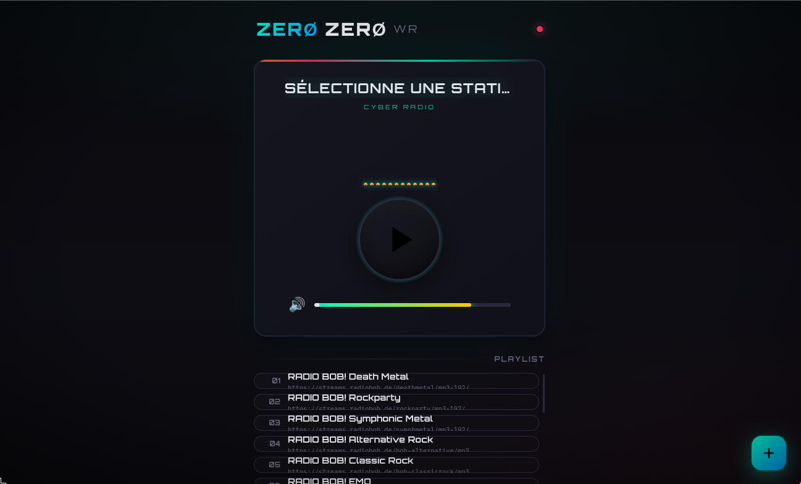

# Zer0-WR

<p align="center">
  
</p>

<p align="center">
  
  
  
  
  
</p>

Lecteur de web-radio cyber-futuriste, léger et immersif, conçu pour écouter des flux audio directement dans le navigateur, sans installation ni dépendances lourdes.

## ✨ Aperçu

Zer0-WR offre une expérience de lecture radio simple, élégante et rapide.  
Son interface futuriste et minimaliste s’adapte parfaitement à une utilisation quotidienne, tout en gardant un accès rapide à la playlist, au volume et aux stations favorites.

## 🎧 Fonctionnalités

- Interface cyber / futuriste avec thème sombre
- Lecture audio native via HTML5
- Gestion de playlist intuitive
- Ajout, modification et suppression de radios
- Navigation rapide entre stations
- Visualiseur animé pendant la lecture
- Contrôle de volume fluide
- Stockage local persistant
- Import / export de playlist au format JSON
- Plus de 30 stations RADIOBOB! préconfigurées
- Compatible avec les navigateurs modernes
- Aucune dépendance externe

## ⌨️ Raccourcis clavier

- Espace : lecture / pause
- Flèches : navigation entre stations
- M : sourdine / restauration du volume
- E : ajouter une station

## 🚀 Installation

```bash
git clone https://github.com/Richerrail/Zer0-WR.git
cd Zer0-WR
```

Puis ouvrez simplement :

```bash
index.html
```

dans votre navigateur préféré.

## 📦 Utilisation

1. Sélectionnez une station dans la playlist
2. Lancez la lecture
3. Réglez le volume selon votre préférence
4. Importez ou exportez votre liste de radios si besoin

## 🧩 Structure du projet

```text
Zer0-WR/
├── index.html
├── README.md
├── LICENSE
├── screenshot.png
```

## 📄 Licence

Ce projet est distribué sous licence MIT.  
Voir le fichier [LICENSE](LICENSE) pour plus de détails.

---

<p align="center">
  <sub>Crédits radio : <a href="https://www.radiobob.de/">RADIOBOB!</a></sub>
</p>
